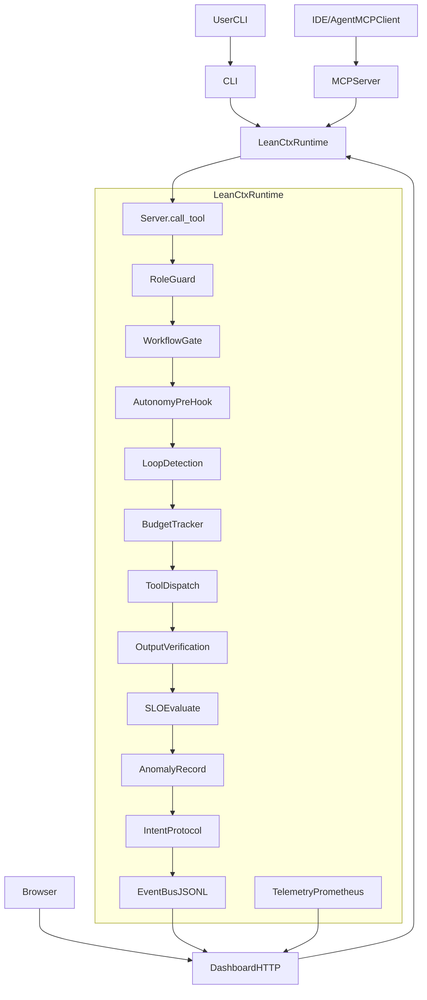

# LeanCTX Feature Catalog (SSOT Snapshot)

**Version:** `3.4.5`  
**Updated:** `2026-04-29`  
**Primary Sources:** `website/generated/mcp-tools.json`, `rust/src/tool_defs/granular.rs`, `README.md`

---

## Purpose

This catalog is the single feature inventory for LeanCTX at release/runtime level:

- Which MCP tools exist now
- Which entry points are canonical vs deprecated aliases
- Which read modes are supported
- Which capabilities are part of the shipped product surface

---

## Runtime Surface (Current)

- Granular MCP tools: **49**
- Unified MCP tools: **5**
- Read modes: **10** (`auto`, `full`, `map`, `signatures`, `diff`, `aggressive`, `entropy`, `task`, `reference`, `lines:N-M`)
- Positioning: Context Runtime for AI agents (shell hook + context server + setup integrations)

---

## Unified MCP Tools (5)

- `ctx`
- `ctx_read`
- `ctx_search`
- `ctx_shell`
- `ctx_tree`

---

## Granular MCP Tools (49)

### A) Read / Search / IO Surface

- `ctx_read`
- `ctx_multi_read`
- `ctx_smart_read`
- `ctx_tree`
- `ctx_search`
- `ctx_semantic_search`
- `ctx_shell`
- `ctx_edit`
- `ctx_delta`
- `ctx_dedup`
- `ctx_fill`
- `ctx_outline`
- `ctx_symbol`
- `ctx_routes`
- `ctx_context`

### B) Architecture / Analysis / Discovery

- `ctx_graph`
- `ctx_graph_diagram` _(deprecated alias -> `ctx_graph action=diagram`)_
- `ctx_callgraph` _(canonical)_
- `ctx_callers` _(deprecated alias -> `ctx_callgraph direction=callers`)_
- `ctx_callees` _(deprecated alias -> `ctx_callgraph direction=callees`)_
- `ctx_architecture`
- `ctx_impact`
- `ctx_review`
- `ctx_intent`
- `ctx_task`
- `ctx_overview`
- `ctx_preload`
- `ctx_prefetch`
- `ctx_discover`
- `ctx_analyze`

### C) Session / Knowledge / Multi-Agent

- `ctx_session`
- `ctx_knowledge`
- `ctx_agent`
- `ctx_share`
- `ctx_handoff`
- `ctx_workflow`
- `ctx_feedback`

### D) Compression / Metrics / Runtime Ops

- `ctx_cache`
- `ctx_compress`
- `ctx_expand`
- `ctx_compress_memory`
- `ctx_metrics`
- `ctx_cost`
- `ctx_heatmap`
- `ctx_gain` _(canonical for wrapped report via `action=wrapped`)_
- `ctx_wrapped` _(deprecated alias -> `ctx_gain action=wrapped`)_
- `ctx_execute`
- `ctx_benchmark`
- `ctx_response`

---

## Deprecation Map (Canonical Paths)

- `ctx_callers` -> `ctx_callgraph direction=callers`
- `ctx_callees` -> `ctx_callgraph direction=callees`
- `ctx_graph_diagram` -> `ctx_graph action=diagram`
- `ctx_wrapped` -> `ctx_gain action=wrapped`

---

## Notes For Releases

- Tool counts and tool names must match `website/generated/mcp-tools.json`.
- Any new tool or alias change requires synchronized updates in:
  - `README.md` and relevant package READMEs
  - `rust/src/templates/*` where applicable
  - this catalog
- Historical counts in old CHANGELOG entries remain unchanged by design.
# LeanCTX Feature Catalog (Source of Truth)

**Package version (Cargo):** `3.4.5`  
**Repo revision:** `ac3aca14d`  
**Updated:** 2026-04-29  

Dieses Dokument ist eine **präzise Gesamtübersicht** über alles, was LeanCTX heute enthält:

- **Interfaces**: CLI, MCP-Server, Dashboard (HTTP), Shell Hook
- **48 MCP-Tools** (mit Zweck und „Nutzungsmodus“)
- **Core-Subsysteme** (106 Module + zusätzliche nicht eingebundene Dateien)
- **Dashboard Endpoints** und **Events**
- **Verdrahtung**: Was läuft automatisch in der Pipeline vs. manuell vs. Baustein

---

## Legende (Status / Verdrahtung)

- **Verdrahtet**: läuft automatisch im Standard-Tool-Flow (`call_tool` in [`rust/src/server/mod.rs`](rust/src/server/mod.rs))
- **Manuell**: existiert und funktioniert, aber nur durch expliziten Aufruf (Tool/CLI/Endpoint) oder bestimmte Modes
- **Baustein (Engine)**: bewusst implementiertes Core-Primitive, aktuell nicht (oder nur indirekt) von User-Flows genutzt
- **Nicht eingebunden**: Datei existiert, wird aber nicht kompiliert (kein `pub mod` in [`rust/src/core/mod.rs`](rust/src/core/mod.rs))

---

## 1) Kontext-OS Dataflow (High-Level)



**Wichtig:** LeanCTX ist bewusst als **Pipeline** gebaut: Features sind nicht „nebeneinander“, sondern als **Schichten** im Tool-Flow.

---

## 2) Die 4 Dimensionen (Vision → konkrete Features)

### Dimension 1 — Compression Layer (Input Efficiency)

- **10 Read Modes**: `full`, `map`, `signatures`, `diff`, `aggressive`, `entropy`, `task`, `reference`, `lines:N-M`, `auto`
- **AST-Signaturen (tree-sitter Feature)**: `signatures_ts` (18 Sprachen)
- **Regex/Fallback-Signaturen**: `signatures`
- **Entropy Filtering**: `entropy`, `surprise`, `adaptive_thresholds`
- **Session Cache**: `cache` (+ `cli_cache`), mtime-validiert
- **Delta Loading / Diff**: `ctx_delta`, `mode=diff`
- **Shell Kompression**: `patterns/*`, `compression_safety`, `filters`, `safety_needles`
- **Cross-file Dedup**: `codebook`, `ctx_dedup`
- **CRP (Context Reduction Protocol)**: `CrpMode` + Output density (tool-/profilgetrieben)

### Dimension 2 — Semantic Router (Model/Mode/Intent)

- **Intent Engine**: `intent_engine` (StructuredIntent, Complexity)
- **Intent Protocol**: `intent_protocol` (Intent aus Toolcalls, Side-Effects)
- **Mode Predictor**: `mode_predictor` (Lernen pro FileSignature)
- **Bandit (Thompson Sampling)**: `bandit` (Exploration vs Exploitation)
- **Adaptive Mode Policy**: `adaptive_mode_policy` + `feedback` + `llm_feedback`

### Dimension 3 — Context Manager (Memory + Governance)

- **Sessions**: `session` + `ctx_session`
- **Knowledge System**: `knowledge`, `memory_lifecycle`, `consolidation_engine`, `knowledge_embedding`
- **Multi-Agent**: `agents`, `a2a/*`, `handoff_ledger`, `ctx_agent`, `ctx_share`, `ctx_handoff`, `ctx_task`
- **Workflow**: `workflow` + `ctx_workflow`
- **Agent Harness**: `roles`, `budget_tracker`, `events`

### Dimension 4 — Quality Guardrail (Output Verification)

- **Output Verification**: `output_verification` (Anchoring/Integrity/InfoLoss)
- **Quality & Preservation**: `quality`, `preservation`
- **Verification Events**: `EventKind::VerificationWarning`

---

## 3) Interface-Schichten (was Nutzer „wirklich“ benutzen)

### 3.1 CLI (Top-Level Capabilities)

LeanCTX bietet eine umfangreiche CLI, die grob in diese Bereiche fällt:

- **Setup/Diagnostics**: `setup`, `bootstrap`, `doctor`, `status`, `uninstall`
- **MCP & Hooks**: `init`, `init --agent …`, `serve` (HTTP MCP), `dashboard`, `watch`
- **Savings/Analytics**: `gain`, `wrapped`, `sessions`, `cep`, `token-report`, `heatmap`
- **Profiles/Themes**: `profile …`, `theme …`, `config`
- **Index/Graph/Read**: `read`, `grep/find/ls`, `deps`, `benchmark`
- **Proxy**: `proxy start/status` (API proxy)
- **Cloud (optional)**: `cloud …` (Feature-Stack abhängig)

**Source:** CLI ist in [`rust/src/main.rs`](rust/src/main.rs) + `rust/src/cli/*` implementiert.

### 3.2 MCP-Server (48 Tools)

Die MCP-Tools sind in [`rust/src/tools/`](rust/src/tools/) implementiert und über [`rust/src/server/dispatch/`](rust/src/server/dispatch/) verdrahtet.

**Wichtige Tool-Modi (ListTools):**

- **Full (Granular)**: `granular_tool_defs()` (viele Tools)
- **Lazy (Default)**: `lazy_tool_defs()` (kleines Set + Discover)
- **Unified**: `unified_tool_defs()`

Source: [`rust/src/server/mod.rs`](rust/src/server/mod.rs) `list_tools()`.

### 3.3 Dashboard (HTTP)

Das Dashboard (`lean-ctx dashboard`) ist ein lokaler HTTP-Server mit `/metrics` und `/api/*`.

Source: [`rust/src/dashboard/mod.rs`](rust/src/dashboard/mod.rs).

---

## 4) MCP Tool Catalog (48) — 1 Satz pro Tool

**Hinweis zum Status:** Fast alle Tools sind **Manuell** (sie laufen, wenn der Agent sie aufruft). Zusätzlich laufen Querschnittsfeatures **Verdrahtet** im `call_tool`-Flow (Roles/Budgets/SLO/Verification/Anomaly/IntentProtocol).

**LOC** sind exakt `wc -l` der jeweiligen `rust/src/tools/*.rs` Datei (Stand `ac3aca14d`).

### Read / Cache / Compression

- **`ctx_read`** ([`rust/src/tools/ctx_read.rs`](rust/src/tools/ctx_read.rs), 985 LOC): Zentrales File-Read mit Modi, Cache, Token-Metriken. **Manuell**
- **`ctx_smart_read`** ([`rust/src/tools/ctx_smart_read.rs`](rust/src/tools/ctx_smart_read.rs), 157 LOC): Auto-Moduswahl (ModePredictor/Heuristik) + `ctx_read`. **Manuell**
- **`ctx_multi_read`** ([`rust/src/tools/ctx_multi_read.rs`](rust/src/tools/ctx_multi_read.rs), 40 LOC): Mehrere Pfade nacheinander via `ctx_read`. **Manuell**
- **`ctx_delta`** ([`rust/src/tools/ctx_delta.rs`](rust/src/tools/ctx_delta.rs), 88 LOC): Diff Disk vs letzter Cache-Stand. **Manuell**
- **`ctx_fill`** ([`rust/src/tools/ctx_fill.rs`](rust/src/tools/ctx_fill.rs), 226 LOC): Füllt Kontextbudget über mehrere Pfade/Modi. **Manuell**
- **`ctx_dedup`** ([`rust/src/tools/ctx_dedup.rs`](rust/src/tools/ctx_dedup.rs), 234 LOC): Cross-file Deduplizierung im Cache. **Manuell**
- **`ctx_compress`** ([`rust/src/tools/ctx_compress.rs`](rust/src/tools/ctx_compress.rs), 101 LOC): Checkpoint/Session-Kompression (Codebook/Cache). **Manuell**
- **`ctx_compress_memory`** ([`rust/src/tools/ctx_compress_memory.rs`](rust/src/tools/ctx_compress_memory.rs), 276 LOC): Komprimiert Markdown auf Disk (mit Backup). **Manuell**
- **`ctx_expand`** ([`rust/src/tools/ctx_expand.rs`](rust/src/tools/ctx_expand.rs), 109 LOC): Listet/holt Archiv-Items. **Manuell**
- **`ctx_context`** ([`rust/src/tools/ctx_context.rs`](rust/src/tools/ctx_context.rs), 87 LOC): Cache-/CRP-/Session-Kontextstatus und Hinweise. **Manuell**
- **`ctx_edit`** ([`rust/src/tools/ctx_edit.rs`](rust/src/tools/ctx_edit.rs), 490 LOC): Such/Replace-Edits in Dateien inkl. Cache-Update. **Manuell**
- **`ctx_preload`** ([`rust/src/tools/ctx_preload.rs`](rust/src/tools/ctx_preload.rs), 464 LOC): Task-basiertes Vorladen in den Cache (Relevance/POP/Budget). **Manuell**
- **`ctx_prefetch`** ([`rust/src/tools/ctx_prefetch.rs`](rust/src/tools/ctx_prefetch.rs), 163 LOC): Einfacheres Vorladen (Blast-Radius, changed_files). **Manuell**
- **`ctx_overview`** ([`rust/src/tools/ctx_overview.rs`](rust/src/tools/ctx_overview.rs), 312 LOC): Projektübersicht nach Task-Relevanz inkl Briefing. **Manuell**
- **`ctx_analyze`** ([`rust/src/tools/ctx_analyze.rs`](rust/src/tools/ctx_analyze.rs), 142 LOC): Datei-Analyse (Entropy/Signatures/Aggressive/Token-Vergleich). **Manuell**
- **`ctx_benchmark`** ([`rust/src/tools/ctx_benchmark.rs`](rust/src/tools/ctx_benchmark.rs), 213 LOC): Vergleicht Read-Modi/Kompression pro Datei (Report). **Manuell**

### Search

- **`ctx_search`** ([`rust/src/tools/ctx_search.rs`](rust/src/tools/ctx_search.rs), 256 LOC): Regex-Suche über Dateien, kompakt formatiert. **Manuell**
- **`ctx_semantic_search`** ([`rust/src/tools/ctx_semantic_search.rs`](rust/src/tools/ctx_semantic_search.rs), 547 LOC): Semantische Suche (BM25/dense/hybrid) über Indizes. **Manuell**

### Shell / Execute

- **`ctx_shell`** ([`rust/src/tools/ctx_shell.rs`](rust/src/tools/ctx_shell.rs), 586 LOC): Shell ausführen + Output-Kompression & Safety. **Manuell**
- **`ctx_execute`** ([`rust/src/tools/ctx_execute.rs`](rust/src/tools/ctx_execute.rs), 196 LOC): Sandbox-/Code-Ausführung. **Manuell**
- **`ctx_discover`** ([`rust/src/tools/ctx_discover.rs`](rust/src/tools/ctx_discover.rs), 222 LOC): Zeigt, welche Commands von Shell-Patterns profitieren. **Manuell**

### Graph / Architecture / Impact

- **`ctx_graph`** ([`rust/src/tools/ctx_graph.rs`](rust/src/tools/ctx_graph.rs), 577 LOC): Graph actions (build/related/symbol/impact/status/enrich/context). **Manuell**
- **`ctx_graph_diagram`** ([`rust/src/tools/ctx_graph_diagram.rs`](rust/src/tools/ctx_graph_diagram.rs), 268 LOC): Mermaid Diagramme (deps/calls). **Manuell**
- **`ctx_architecture`** ([`rust/src/tools/ctx_architecture.rs`](rust/src/tools/ctx_architecture.rs), 705 LOC): Architektur-Analyse über Property Graph. **Manuell**
- **`ctx_impact`** ([`rust/src/tools/ctx_impact.rs`](rust/src/tools/ctx_impact.rs), 350 LOC): Impact-Analyse (Ketten, Status, Build). **Manuell**
- **`ctx_symbol`** ([`rust/src/tools/ctx_symbol.rs`](rust/src/tools/ctx_symbol.rs), 240 LOC): Symbol-Suche im Graph-Index. **Manuell**
- **`ctx_outline`** ([`rust/src/tools/ctx_outline.rs`](rust/src/tools/ctx_outline.rs), 145 LOC): Outline einer Datei aus Signatures. **Manuell**
- **`ctx_callers`** ([`rust/src/tools/ctx_callers.rs`](rust/src/tools/ctx_callers.rs), 73 LOC): Caller-View aus CallGraph. **Manuell**
- **`ctx_callees`** ([`rust/src/tools/ctx_callees.rs`](rust/src/tools/ctx_callees.rs), 78 LOC): Callee-View aus CallGraph. **Manuell**
- **`ctx_routes`** ([`rust/src/tools/ctx_routes.rs`](rust/src/tools/ctx_routes.rs), 120 LOC): Extrahiert HTTP-Routen (für Web-Projekte). **Manuell**

### Knowledge / Memory / Agents / Workflow

- **`ctx_knowledge`** ([`rust/src/tools/ctx_knowledge.rs`](rust/src/tools/ctx_knowledge.rs), 1030 LOC): Knowledge store (remember/recall/timeline/rooms/search/wakeup). **Manuell**
- **`ctx_agent`** ([`rust/src/tools/ctx_agent.rs`](rust/src/tools/ctx_agent.rs), 305 LOC): Multi-agent registry + diary/sync. **Manuell**
- **`ctx_share`** ([`rust/src/tools/ctx_share.rs`](rust/src/tools/ctx_share.rs), 252 LOC): Cache sharing push/pull/list/clear. **Manuell**
- **`ctx_handoff`** ([`rust/src/tools/ctx_handoff.rs`](rust/src/tools/ctx_handoff.rs), 41 LOC): Handoff ledger API (create/list/show/clear). **Manuell**
- **`ctx_task`** ([`rust/src/tools/ctx_task.rs`](rust/src/tools/ctx_task.rs), 241 LOC): A2A Task Store (create/update/list). **Manuell**
- **`ctx_workflow`** ([`rust/src/tools/ctx_workflow.rs`](rust/src/tools/ctx_workflow.rs), 255 LOC): Workflow engine (start/transition/evidence). **Manuell**
- **`ctx_session`** ([`rust/src/tools/ctx_session.rs`](rust/src/tools/ctx_session.rs), 307 LOC): Session control-plane (task/findings/decisions/profile/role/budget/slo/diff/verify/episodes/procedures). **Manuell**

### Observability / Pricing / Feedback

- **`ctx_metrics`** ([`rust/src/tools/ctx_metrics.rs`](rust/src/tools/ctx_metrics.rs), 364 LOC): Session metrics, cache stats, cost estimate. **Manuell**
- **`ctx_cost`** ([`rust/src/tools/ctx_cost.rs`](rust/src/tools/ctx_cost.rs), 84 LOC): Cost attribution reports/reset. **Manuell**
- **`ctx_feedback`** ([`rust/src/tools/ctx_feedback.rs`](rust/src/tools/ctx_feedback.rs), 83 LOC): Feedback-Events + adaptive Mode Policy. **Manuell**
- **`ctx_intent`** ([`rust/src/tools/ctx_intent.rs`](rust/src/tools/ctx_intent.rs), 64 LOC): Intent Klassifikation + Routing-Hinweis. **Manuell**

### Reports / UX

- **`ctx_gain`** ([`rust/src/tools/ctx_gain.rs`](rust/src/tools/ctx_gain.rs), 188 LOC): ROI/Savings/Cost summaries. **Manuell**
- **`ctx_heatmap`** ([`rust/src/tools/ctx_heatmap.rs`](rust/src/tools/ctx_heatmap.rs), 80 LOC): Heatmap über File-Zugriffe. **Manuell**
- **`ctx_review`** ([`rust/src/tools/ctx_review.rs`](rust/src/tools/ctx_review.rs), 265 LOC): Review-Paket (Impact+Callers+Tests+Checklist). **Manuell**
- **`ctx_tree`** ([`rust/src/tools/ctx_tree.rs`](rust/src/tools/ctx_tree.rs), 140 LOC): Kompakter Directory Tree. **Manuell**
- **`ctx_response`** ([`rust/src/tools/ctx_response.rs`](rust/src/tools/ctx_response.rs), 492 LOC): Komprimiert lange Antworten (Filler/Echo). **Manuell**
- **`ctx_wrapped`** ([`rust/src/tools/ctx_wrapped.rs`](rust/src/tools/ctx_wrapped.rs), 6 LOC): Wrapper für WrappedReport. **Manuell**

### Agent / Autonomy Meta

- **`autonomy`** ([`rust/src/tools/autonomy.rs`](rust/src/tools/autonomy.rs), 317 LOC): Autonomie-State/Prehooks (Auto-Preload etc.), kein Dateiread selbst, aber steuert Verhalten. **Manuell**

---

## 5) Dashboard API Catalog (aus `dashboard/mod.rs`)

**Prometheus:** `/metrics` (**Manuell**: läuft nur wenn `lean-ctx dashboard` läuft)  
**HTTP Routes (vollständige Übersicht der dokumentierten Public-Routen):**

- **Core**: `/`, `/index.html`, `/favicon.ico`
- **Prometheus**: `/metrics`
- **Stats & Savings**: `/api/stats`, `/api/gain`, `/api/pulse`, `/api/heatmap`
- **MCP/Runtime**: `/api/mcp`, `/api/session`, `/api/agents`, `/api/profile`
- **Governance & Quality**: `/api/slos`, `/api/anomaly`, `/api/verification`, `/api/intent`, `/api/events`, `/api/feedback`
- **Memory**: `/api/episodes`, `/api/procedures`
- **Knowledge**: `/api/knowledge`, `/api/gotchas`, `/api/buddy`
- **Graph & Code-Intel**: `/api/graph`, `/api/graph/enrich`, `/api/graph/stats`, `/api/call-graph`, `/api/symbols`, `/api/routes`
- **Search**: `/api/search-index`, `/api/search`
- **Demos/Internals**: `/api/compression-demo`, `/api/pipeline-stats`, `/api/context-ledger`, `/api/version`

---

## 6) Event Catalog (aus `core/events.rs`)

Event-Typen (JSONL + Ringbuffer), aus [`rust/src/core/events.rs`](rust/src/core/events.rs):

- `ToolCall`
- `CacheHit`
- `Compression`
- `AgentAction`
- `KnowledgeUpdate`
- `ThresholdShift`
- `BudgetWarning`
- `BudgetExhausted`
- `PolicyViolation`
- `RoleChanged`
- `ProfileChanged`
- `SloViolation`
- `Anomaly`
- `VerificationWarning`
- `ThresholdAdapted`

**Bewusst nicht vorhanden:** kein eigener `EventKind::Intent…` (Intent ist via Session + `/api/intent` sichtbar).

---

## 7) Core Module Inventory (106 + zusätzliche Dateien)

Die Core-Module sind per `pub mod …` in [`rust/src/core/mod.rs`](rust/src/core/mod.rs) angekündigt.

### 7.1 Core-Engines (Auszug, gruppiert)

#### Kompression/Read-Pipeline

- `compressor`, `entropy`, `surprise`, `signatures`, `signatures_ts`, `semantic_chunks`, `quality`, `preservation`, `symbol_map`
- `cache`, `cli_cache`, `context_ledger`, `protocol`, `limits`, `tokens`
- `output_verification`, `pipeline`

#### Graph/Code-Intelligence

- `graph_index`, `property_graph`, `call_graph`, `graph_context`, `graph_enricher`, `deep_queries`, `import_resolver`, `route_extractor`

#### Search/Embeddings

- `embeddings`, `vector_index`, `hybrid_search`, `embedding_index`, `semantic_cache`, `knowledge_embedding`

#### Adaptive/ML/Policies

- `mode_predictor`, `adaptive_thresholds`, `adaptive_mode_policy`, `bandit`, `feedback`, `llm_feedback`, `litm`, `neural`

#### Memory/Session/Knowledge

- `session`, `knowledge`, `memory_lifecycle`, `consolidation_engine`, `gotcha_tracker`, `handoff_ledger`, `agents`, `a2a`, `workflow`

#### Governance/Observability

- `roles`, `budget_tracker`, `slo`, `anomaly`, `events`, `telemetry`, `gain`, `stats`, `heatmap`

#### Shell

- `patterns/*`, `compression_safety`, `filters`, `safety_needles`

### 7.2 Baustein-Beispiel: `rabin_karp`

[`rust/src/core/rabin_karp.rs`](rust/src/core/rabin_karp.rs) (**Baustein / Engine**):

- Content-defined Chunking (`chunk`)
- Stable ordering von Chunks (`stable_order`)
- Reorder von Content gegen „Lost in the Middle“ (`reorder_content`)

Status:
- **Kompiliert:** ja (`pub mod rabin_karp;`)
- **Tests:** ja (`#[cfg(test)]`)
- **Aktive Imports:** ja (u.a. `vector_index` Fallback-Chunks) → **verdrahtet**

### 7.3 Zusätzliche Dateien im Ordner `core/`, aber NICHT eingebunden

Diese Dateien existieren, werden aber **nicht kompiliert** (kein `pub mod`):

- `watcher.rs` (**Nicht eingebunden**) — Polling Watcher (historisch im Changelog als entfernt erwähnt)

### 7.4 Vollständige Core-Inventur (106 Module aus `core/mod.rs` + 4 orphan files)

**LOC** sind aggregierte `wc -l` Summen über alle `.rs` Dateien im Modulbaum (Stand Workspace bei `ac3aca14d`).  
**Status**:
- **[EINGEBUNDEN]** = in [`rust/src/core/mod.rs`](rust/src/core/mod.rs) via `pub mod …` enthalten → kompiliert
- **[NICHT EINGEBUNDEN]** = Datei existiert, aber nicht in `mod.rs` → nicht kompiliert

#### KERN — Kompression, Read-Modi, Caching · Herzstück

- **benchmark (1053)** — Misst Tokens, Latenz und Erhaltungs-Scores pro Datei/Read-Modus, um Vergleiche und Kostenschätzungen zu fahren. **[EINGEBUNDEN]**
- **cache (634)** — Session-Read-Cache mit Hash/mtime und Eviction‑Heuristiken sowie knappe Refs; reduziert Wiederholkosten beim erneuten Lesen. **[EINGEBUNDEN]**
- **cli_cache (321)** — Persistentes TTL/MD5‑Cache für Client‑Reads unter dem Datenverzeichnis. **[EINGEBUNDEN]**
- **codebook (349)** — Baut einen TF-IDF‑Codebuch‑Index über Boilerplate zwischen Dateien zur semantischen Deduplication. **[EINGEBUNDEN]**
- **compressor (504)** — Zentrale Textkompression (ANSI-Stripping, aggressive Modus‑Logik, Diff‑Hooks). **[EINGEBUNDEN]**
- **context_deficit (289)** — Erkennt Lücken zur geladenen Arbeit und schlägt Dateien/Modus vor („Deficit”) auf Basis Intent/Ledger. **[EINGEBUNDEN]**
- **context_ledger (449)** — Führt Kontextfenster, Tokenbilanz (`sent`/`saved`) und Druckstufen („compress/evict”). **[EINGEBUNDEN]**
- **entropy (625)** — Shannon/BPE‑Entropie, Jaccard, Kompressionstreiber und Bewertungen für Entropie-/Auto‑Modi. **[EINGEBUNDEN]**
- **intent_engine (972)** — Klassifikation strukturierter Aufgaben, Task‑Typing, Ziel-/Scope‑Interpretation für Read‑Orchestrierung. **[EINGEBUNDEN]**
- **intent_protocol (427)** — Serien-/Rückruf‑Schema für strukturierte Intents (Subjects, Quellen, Hashes). **[EINGEBUNDEN]**
- **output_verification (537)** — Statische Prüfung komprimierter Antworten (Pfade/IDs/strukturelle Warnungen gegen Referenz). **[EINGEBUNDEN]**
- **pipeline (703)** — Deklariert Pipeline‑Schichten und Statistikpfade je Profil. **[EINGEBUNDEN]**
- **pop_pruning (197)** — Entscheidet welche Repo‑Module („Pop”) beim Task aktiv bleiben vs. gedroppt werden. **[EINGEBUNDEN]**
- **preservation (93)** — Misst Übereinstimmung zwischen Roh‑ und Ausgabe gegen Signaturen/`deps`‑Namen („Preservation‑Score”). **[EINGEBUNDEN]**
- **quality (234)** — Zusammenführt AST‑/Zeilen-/Identifier‑Scores mit Dichte zu einem Güte‑Gate. **[EINGEBUNDEN]**
- **rabin_karp (223)** — Rolling-Hash/Inhaltschunks für effizientes Splitting/Stitching. **[EINGEBUNDEN]**
- **semantic_chunks (416)** — Heuristische Chunk‑Aufteilung und Neuordnung mit Attention‑Brücken („Lost in the Middle”). **[EINGEBUNDEN]**
- **signatures (557)** — Regex‑basierte API‑Signatures und `map`/Compact‑Repräsentation ohne Tree‑sitter. **[EINGEBUNDEN]**
- **signatures_ts (1755)** — Tree‑sitter‑Signatures; alternative zu Regex‑Pfad. **[EINGEBUNDEN]**
- **symbol_map (244)** — Kürzt lange wiederholte Identifier auf kompakte Platzhalter. **[EINGEBUNDEN]**
- **task_briefing (232)** — Baut Briefings nach Task‑Typ/Scope‑Signal (Ausgabeformat-/CRP‑Hinweise). **[EINGEBUNDEN]**

#### SHELL — Shell-Kompression, Patterns

- **compression_safety (269)** — Zuordnung vieler Shell‑Kommandos zu SafetyLevel. **[EINGEBUNDEN]**
- **filters (260)** — Lädt TOML‑Regeln (`filters/*.toml`) zum Regex‑Filtern/Umschreiben von Shell‑Output. **[EINGEBUNDEN]**
- **patterns (11124)** — Sammlung per‑Kommando‑Kompressoren + zentrale `compress_output`-Weiche. **[EINGEBUNDEN]**
- **safety_needles (85)** — Erkennung sicherheitskritischer Zeilen (FATAL, CVE‑…, PANIC…). **[EINGEBUNDEN]**

#### GRAPH — Code-/Call-/Impact

- **call_graph (324)** — Caller→Callee Kanten über Index + AST‑Aufrufe. **[EINGEBUNDEN]**
- **deep_queries (1899)** — Tree‑sitter‑Analyse imports/calls/types/exports mehrer Sprachen. **[EINGEBUNDEN]**
- **deps (518)** — Sprach‑spezifische Import/Export‑Extraktion. **[EINGEBUNDEN]**
- **graph_context (298)** — Token‑budgetierte Nachbarschaftsliste für „task”/`ctx_read`. **[EINGEBUNDEN]**
- **graph_enricher (525)** — Reichert Graph mit Git‑Historie, Tests, Knowledge‑Knoten. **[EINGEBUNDEN]**
- **graph_index (770)** — Projekt‑Index: Dateimetadaten, Symbole, Import‑Kanten, Summaries. **[EINGEBUNDEN]**
- **graph_provider (165)** — Einheitlicher Zugriff auf CodeGraph vs ProjectIndex. **[EINGEBUNDEN]**
- **import_resolver (1334)** — Löst Modul-/Pfad‑Strings zu realen Repo‑Pfaden. **[EINGEBUNDEN]**
- **property_graph (912)** — SQLite‑PropertyGraph API (Knoten/Kanten/Traversals). **[EINGEBUNDEN]**
- **route_extractor (488)** — Extrahiert HTTP‑Routen (Express/Actix/FastAPI/Next/…). **[EINGEBUNDEN]**
- **task_relevance (855)** — Verbreitet Aufgaben‑Heat durch den Dateigraph, empfiehlt Modi. **[EINGEBUNDEN]**

#### MEMORY — Session, Knowledge, Multi-Agent

- **a2a (1312)** — Agent-to-Agent Teilbaum: AgentCard, Messaging, Costs, Limits. **[EINGEBUNDEN]**
- **agents (831)** — Registrierung laufender Agenten, Diary/Scratchpad, Status und Persistenz. **[EINGEBUNDEN]**
- **archive (305)** — Archivierung großer Tool‑Outputs mit Dedup‑ID. **[EINGEBUNDEN]**
- **consolidation_engine (195)** — Promoviert Findings/Decisions in strukturiertes Knowledge unter Budgets. **[EINGEBUNDEN]**
- **gotcha_tracker (1394)** — Erkennung/Persistenz häufiger Fehlmuster („Gotchas“). **[EINGEBUNDEN]**
- **handoff_ledger (432)** — Handoff‑Bundles (Workflow, Evidence, Kurz‑Facts) für Agentwechsel. **[EINGEBUNDEN]**
- **knowledge (1123)** — ProjectKnowledge (Facts, Contradictions, History). **[EINGEBUNDEN]**
- **knowledge_embedding (509)** — Embeddings‑Index zu Knowledge‑Facts inkl. Ranking/Recall. **[EINGEBUNDEN]**
- **memory_lifecycle (435)** — Decay/Consolidation/Compaction für KnowledgeFacts. **[EINGEBUNDEN]**
- **prospective_memory (160)** — Wählt Reminders aus Gotchas passend zur Task. **[EINGEBUNDEN]**
- **session (1182)** — Persistente SessionState (Tasks, Evidence, Decisions, Intents, Stats). **[EINGEBUNDEN]**
- **session_diff (329)** — Strukturdifferenz zweier SessionStates. **[EINGEBUNDEN]**

#### ADAPTIVE — Thresholds, Bandit, Mode-Lernen

- **adaptive (114)** — Klassifikation einer Aufgabe anhand Cache‑Zugriffsstatistik. **[EINGEBUNDEN]**
- **adaptive_mode_policy (233)** — Persistente EMA‑Strafen/Regeln für Modes aus Feedback. **[EINGEBUNDEN]**
- **adaptive_thresholds (397)** — Sprachspezifische Entropie/Jaccard/Auto‑Schwellen. **[EINGEBUNDEN]**
- **bandit (333)** — Thompson-/Beta‑Bandit‑Arme für adaptive Schwellen. **[EINGEBUNDEN]**
- **feedback (327)** — Persistenz von Compression‑Outcomes und gelehrte Schwellen. **[EINGEBUNDEN]**
- **llm_feedback (272)** — JSONL Aggregation LLM‑I/O vs MCP‑Kompression. **[EINGEBUNDEN]**
- **mode_predictor (425)** — Online Statistik optimaler Modes pro FileSignature. **[EINGEBUNDEN]**
- **surprise (160)** — BPE‑basierte „Überraschungs”-Scores („line_surprise”). **[EINGEBUNDEN]**

#### GOVERNANCE — Profile, Roles, Budgets, SLOs, Workflows

- **budget_tracker (353)** — Laufzeit‑Zähler (Tokens/Kosten/Shell) vs RoleLimits. **[EINGEBUNDEN]**
- **budgets (33)** — Konstantengrenzen (Knowledge/Graph/Intent Caps). **[EINGEBUNDEN]**
- **loop_detection (559)** — Wiederhol-Loop-Erkennung und Drosselung. **[EINGEBUNDEN]**
- **profiles (722)** — TOML‑Profile (Read/Compression/Pipeline/Autonomy) + Vererbung. **[EINGEBUNDEN]**
- **roles (627)** — Tool‑Policies + Shell‑Policy + Limits je Rolle. **[EINGEBUNDEN]**
- **slo (516)** — SLO‑TOMLs + Evaluator gekoppelt an BudgetTracker/Events. **[EINGEBUNDEN]**
- **workflow (348)** — Workflow States/Transitions/Evidence + Store/Engine. **[EINGEBUNDEN]**

#### OBSERVABILITY — Telemetry, Events, Anomalien, Heatmap

- **anomaly (329)** — Welford-Fenster/Alerting bei Abweichungen > k·σ. **[EINGEBUNDEN]**
- **events (367)** — EventBus (Ringbuffer + JSONL Persistenz). **[EINGEBUNDEN]**
- **heatmap (305)** — Per‑Datei Karte gesparter Tokens/Compression‑Rates mit Flush. **[EINGEBUNDEN]**
- **slow_log (89)** — Append‑Log langsamer Shell‑Kommandos. **[EINGEBUNDEN]**
- **telemetry (567)** — Atomics/Prometheus‑Textformat/GenAI‑Konventionen. **[EINGEBUNDEN]**

#### SEARCH — Embeddings, Vektor, Hybrid, Semantic

- **embedding_index (411)** — Inkrement embeddings.json je Projekt. **[EINGEBUNDEN]**
- **embeddings (1021)** — EmbeddingEngine + Download/Tokenizer/Pooling. **[EINGEBUNDEN]**
- **hybrid_search (499)** — RRF‑Fusion zwischen BM25 und dense Hits. **[EINGEBUNDEN]**
- **semantic_cache (260)** — TF-IDF Dokument‑Index im Session-/Projektscope. **[EINGEBUNDEN]**
- **vector_index (548)** — BM25 über CodeChunks + Ranking/Snippets. **[EINGEBUNDEN]**

#### SECURITY — Jail, Sandbox, Sanitizing

- **pathjail (245)** — Sandbox für File-Access (Jail, allow_paths). **[EINGEBUNDEN]**
- **sandbox (501)** — Eingeschränkte Ausführung mit Caps/Timeout. **[EINGEBUNDEN]**
- **sanitize (96)** — Sanitizing gefährlicher Zeichen. **[EINGEBUNDEN]**

#### INFRA — Config, Paths, Manifest, Updater

- **config (878)** — Zentrale Config-TOML inkl. Feature-Slices. **[EINGEBUNDEN]**
- **data_dir (39)** — Auflösung Data-Dir (`LEAN_CTX_DATA_DIR`/XDG). **[EINGEBUNDEN]**
- **editor_registry (1686)** — Detect/Writer für Editor-Integrationen. **[EINGEBUNDEN]**
- **error (36)** — `LeanCtxError`/Result Typen. **[EINGEBUNDEN]**
- **home (31)** — Home-Dir Resolver. **[EINGEBUNDEN]**
- **integrity (98)** — Integritäts-/Seed Checks. **[EINGEBUNDEN]**
- **jsonc (154)** — JSONC Parsing (Kommentarentfernung). **[EINGEBUNDEN]**
- **language_capabilities (159)** — LanguageId→Capabilities Mapping. **[EINGEBUNDEN]**
- **limits (22)** — Max-Byte Reads/Shell Grenzen via Env. **[EINGEBUNDEN]**
- **logging (28)** — Logging init helper (aktuell kaum genutzt). **[EINGEBUNDEN]**
- **mcp_manifest (106)** — JSON Manifest Generator für Tools/Readmodes. **[EINGEBUNDEN]**
- **pathutil (110)** — Safe canonicalize/Windows Path fixes. **[EINGEBUNDEN]**
- **portable_binary (88)** — EXE-Resolution (Hooks/Starter). **[EINGEBUNDEN]**
- **project_hash (595)** — Stabiler Projekt-Hash. **[EINGEBUNDEN]**
- **protocol (346)** — Project-root/CWD Detection + Helpers. **[EINGEBUNDEN]**
- **provider_cache (259)** — Prefix/Provider Cache State. **[EINGEBUNDEN]**
- **setup_report (61)** — Setup/Doctor Report-Strukturen. **[EINGEBUNDEN]**
- **tdd_schema (80)** — JSON Schema für TDD/Readmodes. **[EINGEBUNDEN]**
- **tokens (83)** — BPE Token Counter (tiktoken). **[EINGEBUNDEN]**
- **updater (370)** — Self-update Mechanik (Releases→Binary swap). **[EINGEBUNDEN]**
- **version_check (179)** — Daily version check (opt-out). **[EINGEBUNDEN]**
- **index_orchestrator (238)** — Koordiniert Background Index Builds. **[EINGEBUNDEN]**

#### NEURAL — Attention Heuristiken / Learned Scorers

- **attention_model (288)** — Heuristische Attention auf Zeilenbasis. **[EINGEBUNDEN]**
- **litm (333)** — Lost-in-the-Middle Positioning. **[EINGEBUNDEN]**
- **neural (1479)** — ONNX-basierte Learned Attention/LineScorer + Optimizer. **[EINGEBUNDEN]**

#### UI / Reporting

- **buddy (1175)** — Token Guardian/Gamification + Darstellung. **[EINGEBUNDEN]**
- **gain (815)** — Gain Engine (Savings/ROI/Costs). **[EINGEBUNDEN]**
- **stats (1847)** — Aggregierte KPIs (flush/merge). **[EINGEBUNDEN]**
- **theme (609)** — Themes/Colors/Formatting. **[EINGEBUNDEN]**
- **wrapped (166)** — Wrapped Report Generator. **[EINGEBUNDEN]**

#### Orphan Files (nicht eingebunden, nicht kompiliert)

- **watcher (300)** — FileTracker/ScanResult (Polling Watcher). **[NICHT EINGEBUNDEN]**

---

## 8) Verdrahtungs-Status (Masterplan-Features)

### Verdrahtet (läuft im `call_tool` Flow)

- **Role guard** (Policy + shell policy)
- **Budget tracking** (tokens/shell/cost) + Events
- **SLO evaluation** (`[SLO]` appended)
- **Anomaly record** (`tokens_per_call`)
- **Output verification** (per Profile)
- **Intent protocol** (infer_from_tool_call + record_intent)

### Verdrahtet nur im Read-Pfad

- **Profiles → default_mode** (wenn Tool keinen `mode` angibt)
- **ModePredictor/Bandit feedback** (wird nach `ctx_read` Outcome gespeichert)
- **StructuredIntent aus touched files** (ab bestimmter Session-Aktivität)

### Manuell / bedingt

- **Graph enrichment**: `ctx_graph action=enrich` oder `/api/graph/enrich`
- **Graph context**: automatisch nur wenn Read-Mode == `task`
- **Session diffing**: `ctx_session action=diff`

---

## 9) Bekannte Präzisions-Lücken (für „perfekt verdrahtet“)

Diese Punkte sind **kein Feature-Creep**, sondern „Wiring/Polish“, um das System wirklich „Context OS“ zu machen:

1. **Watcher-Aufräum-Entscheid**: `watcher.rs` ist historisch „removed“, existiert aber noch als Orphan → deprecate & entfernen oder sauber re-verdrahten (bewusst).
2. **Intent Observability**: Intent existiert in Sessions + `/api/intent`; ein eigener Event-Typ ist optional (nur falls wir “Live Feed”/Audit stärker brauchen).

---

## Appendix A — Exakte Core-Modul-Liste (`core/mod.rs`)

Quelle: [`rust/src/core/mod.rs`](rust/src/core/mod.rs). Diese Liste ist die **Build-Wahrheit** (alles hier wird kompiliert).

```text
a2a
adaptive
adaptive_mode_policy
adaptive_thresholds
agents
anomaly
archive
attention_model
bandit
benchmark
buddy
budget_tracker
budgets
cache
call_graph
cli_cache
codebook
compression_safety
compressor
config
consolidation_engine
context_deficit
context_ledger
data_dir
deep_queries
deps
editor_registry
embedding_index
embeddings
entropy
error
events
feedback
filters
gain
gotcha_tracker
graph_context
graph_enricher
graph_index
graph_provider
handoff_ledger
heatmap
home
hybrid_search
import_resolver
index_orchestrator
integrity
intent_engine
intent_protocol
jsonc
knowledge
knowledge_embedding
language_capabilities
limits
litm
llm_feedback
logging
loop_detection
mcp_manifest
memory_lifecycle
mode_predictor
neural
output_verification
pathjail
pathutil
patterns
pipeline
pop_pruning
portable_binary
preservation
profiles
project_hash
property_graph
prospective_memory
protocol
provider_cache
quality
rabin_karp
roles
route_extractor
safety_needles
sandbox
sanitize
semantic_cache
semantic_chunks
session
session_diff
setup_report
signatures
signatures_ts (feature: tree-sitter)
slo
slow_log
stats
surprise
symbol_map
task_briefing
task_relevance
tdd_schema
telemetry
theme
tokens
updater
vector_index
version_check
workflow
wrapped
```

**Nicht in `core/mod.rs` (nicht kompiliert):** `watcher.rs`.

---

## Appendix B — Exakte MCP Tool-Modul-Liste (`tools/mod.rs`)

Quelle: [`rust/src/tools/mod.rs`](rust/src/tools/mod.rs). Diese Liste ist die **Tool-Oberfläche** (48 Tools).

```text
autonomy
ctx_agent
ctx_analyze
ctx_architecture
ctx_benchmark
ctx_callees
ctx_callers
ctx_compress
ctx_compress_memory
ctx_context
ctx_cost
ctx_dedup
ctx_delta
ctx_discover
ctx_edit
ctx_execute
ctx_expand
ctx_feedback
ctx_fill
ctx_gain
ctx_graph
ctx_graph_diagram
ctx_handoff
ctx_heatmap
ctx_impact
ctx_intent
ctx_knowledge
ctx_metrics
ctx_multi_read
ctx_outline
ctx_overview
ctx_prefetch
ctx_preload
ctx_read
ctx_response
ctx_review
ctx_routes
ctx_search
ctx_semantic_search
ctx_session
ctx_share
ctx_shell
ctx_smart_read
ctx_symbol
ctx_task
ctx_tree
ctx_workflow
ctx_wrapped
```

---

## 10) Verwandte Dokumente (Repository)

- Überblick/Positionierung: [`VISION.md`](VISION.md)
- Changelog: [`CHANGELOG.md`](CHANGELOG.md)
- Vollständige narrative Dokumentation: [`LEANCTX_COMPLETE_DOCUMENTATION.md`](LEANCTX_COMPLETE_DOCUMENTATION.md)
- Tool-Dokumentation (Website): `lean-ctx-deploy/website/src/pages/docs/tools/*`

